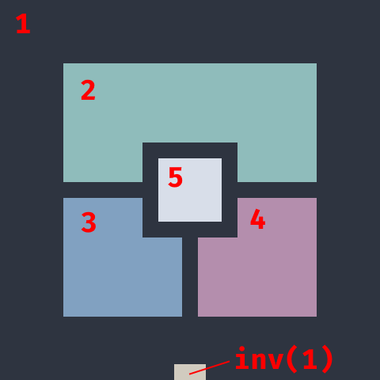
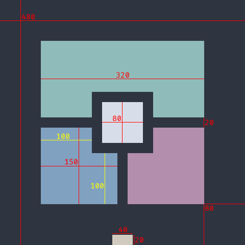

# UUID Englyphenation
Visualise UUIDs. Display a unique glyph for each of the 5,316,911,983,139,663,491,615,228,241,121,378,304 v4 UUIDs.

Choose a UUID based on how nice it looks!

Prototype demonstration available at https://uuid.wacton.xyz/

## Examples

| GUID                                   | Glyph                                                                                                          |
|----------------------------------------|----------------------------------------------------------------------------------------------------------------|
| `2e34408f-bcbb-481a-81c1-b48eadd8dee9` |  |
| `eceff4bf-616a-4ebc-bb8b-88c0d04c566a` |  |
| `40404640-e8ff-4e8e-a846-e840ffe8e8ff` |  |

## Specification 1.0

The example in this section uses `2e34408f-bcbb-481a-81c1-b48eadd8dee9`.

| Variable | Value                                                        | Example  |
|----------|--------------------------------------------------------------|----------|
| Colour 1 | Concatenate characters 0, 1, 2, 3, 4, 5                      | `2e3440` |
| Colour 2 | Concatenate characters 6, 7, 9, 10, 11, 12                   | `8fbcbb` | 
| Colour 3 | Concatenate characters 15, 16, 17, 20, 21, 22                | `81a1c1` |
| Colour 4 | Concatenate characters 24, 25, 26, 27, 28, 29                | `b48ead` |
| Colour 5 | Concatenate characters 30, 31, 32, 33, 34, 35                | `d8dee9` |
| Rotation | Character 19: `8` = 0° · `9` = 90° · `a` = 180° · `b` = 270° | `8` = 0° |

Characters 8, 13, 18, 23 are ignored; they are `-` delimiters that do not change.

Character 14 is ignored; it is always `4` signifying v4 UUID.

Image size is relative to the inner margin, which should be a multiple of 2 for a pixel-perfect image.
For reference, when the inner margin is 2 pixels, the full image is 48x48 pixels.

Colours and dimensions are set as follows. The dimensions guide is based on an inner margin of 20 pixels.

Any rotation is applied clockwise once the colours have been applied at the correct dimensions.
